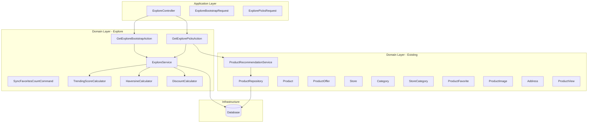

# Design Document: Explore Page API

## Overview

This design describes the backend implementation for the Explore page API endpoints in the Coupony mobile app. The feature provides a discovery-driven experience with two main endpoints: a bootstrap endpoint (`GET /api/v1/explore`) that aggregates multiple sections (trending offers, flash deals, top stores, nearby offers) into a single response, and a paginated picks endpoint (`GET /api/v1/explore/picks`) for the "Picked for You" feed with filtering and sorting.

The design follows the existing domain-driven architecture with:
- A new `Explore` domain under `app/Domain/Explore/` containing the service, actions, and DTOs
- Controller and request classes under `app/Application/Http/`
- A database migration for the `favorites_count` denormalization on the `products` table
- Optional authentication support (no 401 for missing tokens)

Key design decisions:
- **Single bootstrap endpoint** to minimize mobile network round-trips
- **Denormalized `favorites_count`** to avoid expensive JOIN queries for popularity sorting
- **Haversine formula** for distance calculation (sufficient accuracy for store proximity)
- **Reuse of `ProductRecommendationService`** for the picks endpoint personalization
- **Query-level filtering** applied before aggregation to keep response sizes manageable

## Architecture



### Request Flow

1. Request arrives at explore endpoint (optionally with Bearer token)
2. Controller resolves optional authentication via `resolveAuthenticatedUser()`
3. Form Request validates query parameters (filters, pagination, coordinates)
4. Action orchestrates the service to build the response sections
5. Each section queries the database with shared base filters (active products, active offers, active stores)
6. Section-specific logic applies (scoring, time windows, distance, recommendations)
7. Response is assembled with field mappings and returned

### Optional Authentication Flow

The explore endpoints use a custom middleware approach:
- Routes are NOT wrapped in `auth:sanctum` middleware
- The controller manually resolves the user from the Bearer token if present
- If no token or invalid token: user is `null`, `is_favorite` defaults to `false`
- If valid token: user is resolved, `is_favorite` reflects actual favorite status

## Components and Interfaces

### Controller: `ExploreController`

**Location:** `app/Application/Http/Controllers/API/V1/ExploreController.php`

```php
class ExploreController extends Controller
{
    public function __construct(
        private readonly GetExploreBootstrapAction $bootstrapAction,
        private readonly GetExplorePicksAction $picksAction,
    ) {}

    public function bootstrap(ExploreBootstrapRequest $request): JsonResponse;
    public function picks(ExplorePicksRequest $request): JsonResponse;
}
```

### Form Requests

**`ExploreBootstrapRequest`** — validates optional query parameters:
- `interest_id`: nullable, integer, exists in `categories` table where `is_active = true`
- `activity_id`: nullable, integer, exists in `store_categories` table where `is_active = true`
- `search`: nullable, string, max:200
- `lat`: nullable, numeric, between:-90,90
- `lng`: nullable, numeric, between:-180,180 (required_with:lat)

**`ExplorePicksRequest`** — validates optional query parameters:
- All parameters from `ExploreBootstrapRequest` plus:
- `page`: nullable, integer, min:1
- `page_size`: nullable, integer, min:1, max:50
- `min_discount_percent`: nullable, integer, min:0, max:90
- `sort_by`: nullable, string, in:trending,newest,most_saved,highest_discount

### Actions

**`GetExploreBootstrapAction`**
- Input: `ExploreBootstrapRequest` (validated), `?User` (optional authenticated user)
- Output: array with `interests`, `activities`, `trending`, `flash`, `top_stores`, `nearby`, `server_time`
- Delegates to `ExploreService` for each section

**`GetExplorePicksAction`**
- Input: `ExplorePicksRequest` (validated), `?User` (optional authenticated user)
- Output: array with `data` (paginated offers) and `pagination` metadata
- Uses `ProductRecommendationService` for authenticated users, falls back to popular products for guests
- Applies filters and sorting on top of recommendation results

### Service: `ExploreService`

**Location:** `app/Domain/Explore/Services/ExploreService.php`

```php
class ExploreService
{
    public function getInterests(): Collection;
    public function getActivities(): Collection;
    public function getTrendingOffers(array $filters, ?User $user, int $limit = 10): Collection;
    public function getFlashOffers(array $filters, ?User $user): Collection;
    public function getTopStores(array $filters): Collection;
    public function getNearbyOffers(array $filters, ?User $user, float $lat, float $lng): Collection;
    public function getPickedOffers(array $filters, ?User $user, int $page, int $pageSize): LengthAwarePaginator;
}
```

### Utility Classes

**`TrendingScoreCalculator`**

**Location:** `app/Domain/Explore/Support/TrendingScoreCalculator.php`

```php
class TrendingScoreCalculator
{
    /**
     * Calculate trending score using the formula:
     * active_campaign_priority * 3 + saved_count * 1 + views_last_7_days * 0.5
     * + discount_percent * 0.2 + recency_score
     *
     * recency_score: days since creation, capped at 30, inverted (30 - days)
     */
    public static function calculate(
        int $campaignPriority,
        int $savedCount,
        int $viewsLast7Days,
        float $discountPercent,
        float $recencyScore
    ): float;
}
```

**`HaversineCalculator`**

**Location:** `app/Domain/Explore/Support/HaversineCalculator.php`

```php
class HaversineCalculator
{
    /**
     * Calculate distance in kilometers between two coordinate pairs
     * using the Haversine formula.
     */
    public static function distanceKm(
        float $lat1, float $lng1,
        float $lat2, float $lng2
    ): float;
}
```

**`DiscountCalculator`**

**Location:** `app/Domain/Explore/Support/DiscountCalculator.php`

```php
class DiscountCalculator
{
    /**
     * Calculate discount percentage and discounted price from an offer.
     * - For percentage-type offers: uses percentage_value directly
     * - For fixed-type offers: calculates (fixed_amount / base_price) * 100
     *
     * Returns [discount_percent, discounted_price]
     */
    public static function calculate(ProductOffer $offer, float $basePrice): array;
}
```

### Artisan Command: `SyncFavoritesCount`

**Location:** `app/Application/Console/Commands/SyncFavoritesCount.php`

```php
class SyncFavoritesCount extends Command
{
    protected $signature = 'explore:sync-favorites-count';
    protected $description = 'Synchronize favorites_count column with actual counts from product_favorites table';

    public function handle(): int;
}
```

### Routes

```php
// In routes/api.php, public routes (no auth middleware)
Route::get('/explore', [ExploreController::class, 'bootstrap'])->name('explore.bootstrap');
Route::get('/explore/picks', [ExploreController::class, 'picks'])->name('explore.picks');
```

### Event Listeners for Favorites Count

The existing `FavoriteProduct` and `UnfavoriteProduct` actions will be modified to increment/decrement the `favorites_count` column atomically:

```php
// In FavoriteProduct::execute()
$product->increment('favorites_count');

// In UnfavoriteProduct::execute()
$product->decrement('favorites_count', 1, ['favorites_count' => DB::raw('GREATEST(favorites_count - 1, 0)')]);
// Actually use: DB::table('products')->where('id', $product->id)->update(['favorites_count' => DB::raw('GREATEST(favorites_count - 1, 0)')]);
```

## Data Models

### New Column: `products.favorites_count`

A migration adds an unsigned integer column to the `products` table:

```php
Schema::table('products', function (Blueprint $table) {
    $table->unsignedInteger('favorites_count')->default(0)->after('rating_count');
    $table->index('favorites_count');
});
```

### Base Query: Active Products with Active Offers

All explore sections share a base query scope:

```php
Product::query()
    ->where('status', ProductStatus::ACTIVE)
    ->where('approval_status', ProductApprovalStatus::APPROVED)
    ->whereHas('store', fn ($q) => $q->whereIn('status', [StoreStatus::ACTIVE]))
    ->whereHas('offer', fn ($q) => $q->where('status', ProductOfferStatus::ACTIVE));
```

Note: The requirements mention "active or approved" store status. Since the `StoreStatus` enum only has `ACTIVE` (not `APPROVED`), this maps to `StoreStatus::ACTIVE` which represents stores that have been approved and are active.

### Trending Score Calculation (SQL)

The trending score is calculated as a computed column in the query:

```sql
SELECT *,
  (COALESCE(campaign_priority, 0) * 3
   + favorites_count * 1
   + (SELECT COUNT(*) FROM product_views WHERE product_id = products.id AND created_at >= NOW() - INTERVAL 7 DAY) * 0.5
   + discount_percent * 0.2
   + GREATEST(30 - DATEDIFF(NOW(), product_offers.created_at), 0)
  ) AS trending_score
FROM products
...
ORDER BY trending_score DESC
LIMIT 10
```

Note: `saved_count` in the formula maps to `favorites_count` (the denormalized column). `campaign_priority` will be sourced from a nullable column or default to 0 if no active campaign exists.

### Flash Offers Time Window Query

```sql
WHERE product_offers.ends_at > NOW()
  AND product_offers.ends_at <= NOW() + INTERVAL 24 HOUR
ORDER BY product_offers.ends_at ASC
```

### Nearby Offers Distance Query (Haversine)

```sql
SELECT *,
  (6371 * ACOS(
    COS(RADIANS(:lat)) * COS(RADIANS(addresses.latitude))
    * COS(RADIANS(addresses.longitude) - RADIANS(:lng))
    + SIN(RADIANS(:lat)) * SIN(RADIANS(addresses.latitude))
  )) AS distance_km
FROM products
JOIN stores ON products.store_id = stores.id
JOIN addressables ON addressables.owner_id = stores.id AND addressables.owner_type = 'App\\Domain\\Store\\Models\\Store'
JOIN addresses ON addresses.id = addressables.address_id
WHERE addresses.latitude IS NOT NULL AND addresses.longitude IS NOT NULL
ORDER BY distance_km ASC
```

### Response Field Mappings

| Response Field | Source |
|---|---|
| `id` | `product_offers.id` |
| `product_id` | `products.id` |
| `store_id` | `products.store_id` |
| `image_url` | First `product_images` by `sort_order` → `url` |
| `title` | `product_offers.label` (or `products.title` if label is null) |
| `store_name` | `stores.name` |
| `discount_percent` | Calculated via `DiscountCalculator` |
| `original_price` | `products.base_price` |
| `discounted_price` | Calculated via `DiscountCalculator` |
| `saved_count` | `products.favorites_count` |
| `interest_id` | First category ID from `product_categories` |
| `activity_id` | First store category ID from `store_store_category` |
| `is_favorite` | `product_favorites` lookup for authenticated user, else `false` |
| `expires_at` | `product_offers.ends_at` (flash offers only) |
| `distance_km` | Haversine calculation (nearby offers only) |
| `created_at` | `product_offers.created_at` (picks only) |

### Pagination Metadata Structure

```json
{
  "page": 1,
  "page_size": 12,
  "total": 156,
  "total_pages": 13,
  "has_more": true
}
```

## Correctness Properties

*A property is a characteristic or behavior that should hold true across all valid executions of a system — essentially, a formal statement about what the system should do. Properties serve as the bridge between human-readable specifications and machine-verifiable correctness guarantees.*

### Property 1: Bootstrap Response Structure Completeness

*For any* valid request to the explore bootstrap endpoint (with any combination of valid filters and any database state), the response SHALL always contain the keys `interests`, `activities`, `trending`, `flash`, `top_stores`, `nearby`, and `server_time`, each with their expected type (arrays for sections, ISO 8601 string for server_time).

**Validates: Requirements 1.1, 1.4**

### Property 2: Active Product Filtering Invariant

*For any* offer returned by either the bootstrap or picks endpoint, the associated product SHALL have `status = active` and `approval_status = approved`, the associated store SHALL have `status = active`, and the associated offer SHALL have `status = active`.

**Validates: Requirements 1.7, 6.7**

### Property 3: Favorite Status Correctness

*For any* authenticated user and any offer in the response, the `is_favorite` field SHALL be `true` if and only if a record exists in `product_favorites` for that user and product. *For any* unauthenticated request, `is_favorite` SHALL be `false` for all offers.

**Validates: Requirements 1.5, 1.6, 6.8, 6.9, 14.1**

### Property 4: Trending Score Calculation

*For any* set of non-negative input values (campaign_priority, saved_count, views_last_7_days, discount_percent, recency_score), the `TrendingScoreCalculator::calculate()` method SHALL return `campaign_priority * 3 + saved_count * 1 + views_last_7_days * 0.5 + discount_percent * 0.2 + recency_score`.

**Validates: Requirements 2.2**

### Property 5: Trending Offers Sort Order

*For any* list of trending offers returned by the bootstrap endpoint, the items SHALL be sorted by Trending_Score in descending order (each item's score >= the next item's score).

**Validates: Requirements 2.1**

### Property 6: Flash Offers Time Window

*For any* flash offer returned by the bootstrap endpoint, its `expires_at` value SHALL be greater than the current server time AND less than or equal to 24 hours from the current server time. Additionally, flash offers SHALL be sorted by `expires_at` in ascending order.

**Validates: Requirements 3.1, 3.3, 3.4**

### Property 7: Top Stores Best Coupon Selection

*For any* store in the top_stores response that has multiple active offers, the `best_coupon_discount` SHALL equal the maximum Discount_Percent among all active offers for that store.

**Validates: Requirements 4.3**

### Property 8: Haversine Distance Calculation

*For any* two valid coordinate pairs (lat1, lng1) and (lat2, lng2), the `HaversineCalculator::distanceKm()` method SHALL return a non-negative value, return 0 when both points are identical, and satisfy the triangle inequality (distance(A,B) + distance(B,C) >= distance(A,C)).

**Validates: Requirements 5.3**

### Property 9: Nearby Offers Distance Sort Order

*For any* list of nearby offers returned when lat/lng are provided, the items SHALL be sorted by `distance_km` in ascending order (each item's distance <= the next item's distance).

**Validates: Requirements 5.1**

### Property 10: Filter Application Universality

*For any* `interest_id` filter applied to the bootstrap endpoint, every product in every section (trending, flash, top_stores, nearby) SHALL belong to the specified category. *For any* `activity_id` filter, every product SHALL belong to a store in the specified store category. *For any* `search` filter, every item's title or store_name SHALL contain the search term (case-insensitive).

**Validates: Requirements 7.1, 7.2, 8.1, 8.2, 9.1, 9.2, 9.4**

### Property 11: Discount Calculation Correctness

*For any* product with `base_price > 0` and an offer, the `DiscountCalculator` SHALL produce: for percentage-type offers, `discount_percent = percentage_value` and `discounted_price = base_price * (1 - percentage_value/100)`; for fixed-type offers, `discount_percent = (fixed_amount / base_price) * 100` and `discounted_price = base_price - fixed_amount`.

**Validates: Requirements 16.6, 16.7**

### Property 12: Sort Options Correctness

*For any* valid `sort_by` value applied to the picks endpoint, the results SHALL be sorted by the corresponding field in descending order: `trending` → Trending_Score, `newest` → created_at, `most_saved` → favorites_count, `highest_discount` → Discount_Percent.

**Validates: Requirements 11.1, 11.2, 11.3, 11.4**

### Property 13: Pagination Validation

*For any* `page` value < 1 or non-integer, or `page_size` value outside [1, 50] or non-integer, the picks endpoint SHALL return a 422 response. *For any* valid pagination parameters, the response SHALL contain correct `total_pages` (ceil(total/page_size)) and `has_more` (page < total_pages).

**Validates: Requirements 12.1, 12.2, 12.4, 6.5**

### Property 14: Favorites Count Increment/Decrement Round-Trip

*For any* product, if a user favorites it, `favorites_count` SHALL increase by exactly 1. If a user unfavorites it, `favorites_count` SHALL decrease by exactly 1 (but never below 0). After the sync command runs, `favorites_count` SHALL equal the actual count of records in `product_favorites` for that product.

**Validates: Requirements 13.2, 13.3, 13.4, 13.5**

### Property 15: Minimum Discount Filter

*For any* `min_discount_percent` value in [0, 90] applied to the picks endpoint, every returned offer SHALL have a calculated Discount_Percent >= the specified value. *For any* value outside [0, 90], the endpoint SHALL return a 422 response.

**Validates: Requirements 10.1, 10.2, 10.3**

### Property 16: Combined Filter AND Logic

*For any* combination of filters (interest_id, activity_id, search, min_discount_percent) applied simultaneously, every returned result SHALL satisfy ALL active filter conditions. When no results match, the response SHALL contain an empty data array with `total: 0` and `has_more: false`.

**Validates: Requirements 15.1, 15.2, 15.3**

## Error Handling

| Scenario | HTTP Status | Response |
|----------|-------------|----------|
| Invalid `interest_id` (non-existent/inactive category) | 400 | `{"success": false, "message": "Invalid interest_id..."}` |
| Invalid `activity_id` (non-existent/inactive store category) | 400 | `{"success": false, "message": "Invalid activity_id..."}` |
| Invalid `min_discount_percent` (outside 0-90) | 422 | `{"success": false, "message": "...", "errors": {...}}` |
| Invalid `sort_by` value | 422 | `{"success": false, "message": "...", "errors": {...}}` |
| Invalid `page` or `page_size` | 422 | `{"success": false, "message": "...", "errors": {...}}` |
| Missing/invalid Bearer token | 200 | Normal response with `is_favorite: false` |
| No lat/lng provided | 200 | `nearby` section is empty array `[]` |
| No eligible offers for a section | 200 | Section returns empty array `[]` |
| Database/server error | 500 | `{"success": false, "message": "..."}` |

### Error Handling Strategy

- **Validation errors** are handled by Laravel Form Requests (automatic 422 responses for type/range violations)
- **Custom validation** for `interest_id` and `activity_id` existence checks returns 400 via custom rule or controller logic
- **Optional auth** is handled by `resolveAuthenticatedUser()` in the base Controller — never throws 401
- **Empty sections** are returned as empty arrays, never as errors
- **Database errors** are caught in try/catch blocks, logged via `report()`, and return 500 with generic message

## Testing Strategy

### Unit Tests (PHPUnit)

Unit tests cover specific examples, edge cases, and integration points:

- **TrendingScoreCalculator**: specific known-value calculations, zero inputs, large values
- **HaversineCalculator**: known city-pair distances (e.g., Cairo to Alexandria ≈ 180km), same-point = 0, antipodal points
- **DiscountCalculator**: percentage-type offers, fixed-type offers, edge cases (100% discount, 0 base price)
- **Optional auth**: verify no 401 for missing token, invalid token treated as guest
- **Empty state**: verify all sections return empty arrays when no data exists
- **Default values**: verify page=1, page_size=12, sort_by=trending defaults
- **Arabic search**: verify Arabic text matching works correctly
- **Flash time window edge cases**: offers expiring exactly at boundary times

### Property-Based Tests (PHPUnit with data providers)

Property-based tests use PHPUnit `@dataProvider` methods with `Faker` for randomized input generation (100+ iterations per property). Each test references its design property.

**Library:** PHPUnit with `@dataProvider` methods using `Faker` for randomized input generation (100 iterations per property).

**Tag format:** `Feature: explore-page, Property {number}: {property_text}`

| Property | Test Class | What's Generated |
|----------|-----------|-----------------|
| P4: Trending Score | `TrendingScoreCalculatorTest` | Random (priority, saved, views, discount, recency) tuples |
| P8: Haversine Distance | `HaversineCalculatorTest` | Random coordinate pairs within valid ranges |
| P11: Discount Calculation | `DiscountCalculatorTest` | Random (base_price, percentage_value, fixed_amount) combinations |
| P13: Pagination Validation | `ExplorePicksRequestTest` | Random invalid page/page_size values |
| P14: Favorites Count | `FavoritesCountTest` | Random sequences of favorite/unfavorite operations |
| P15: Min Discount Filter | `MinDiscountFilterTest` | Random discount values and filter thresholds |

### Integration Tests (Feature Tests)

- Full HTTP request/response cycle for both endpoints
- Database seeding with realistic data across all sections
- Filter combination testing (AND logic verification)
- Sort order verification with seeded data
- Pagination boundary testing
- Optional auth flow (no token, valid token, expired token)

### File Organization

```
tests/
├── Unit/
│   └── Domain/
│       └── Explore/
│           ├── TrendingScoreCalculatorTest.php
│           ├── HaversineCalculatorTest.php
│           └── DiscountCalculatorTest.php
├── Feature/
│   └── Explore/
│       ├── ExploreBootstrapTest.php
│       ├── ExplorePicksTest.php
│       ├── ExploreFiltersTest.php
│       └── FavoritesCountSyncTest.php
```
