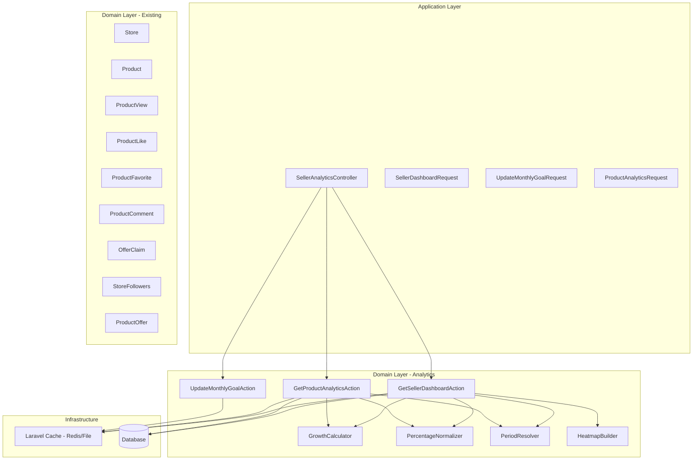

# Design Document: Seller Product Analytics

## Overview

This design describes the backend implementation for the Seller Product Analytics feature in the Coupony platform. The feature provides two main analytics endpoints — a store-level dashboard and per-product analytics — plus a monthly goal management endpoint. The system aggregates data from existing models (ProductView, ProductLike, ProductFavorite, ProductComment, OfferClaim, StoreFollowers) and presents computed metrics with caching, period filtering, and safe zero-data handling.

The design follows the existing domain-driven architecture with:
- A new `Analytics` domain under `app/Domain/Analytics/`
- Controller and request classes under `app/Application/Http/`
- Reusable calculation services for growth percentages and percentage normalization

## Architecture



### Request Flow

1. Authenticated request arrives with Bearer token (Sanctum middleware)
2. Controller validates request via Form Request
3. Authorization check: user owns/manages the store (or product belongs to their store)
4. Action checks cache; returns cached response if available
5. If cache miss, Action queries existing models, computes metrics using services
6. Response is cached with appropriate TTL and returned

## Components and Interfaces

### Controller: `SellerAnalyticsController`

**Location:** `app/Application/Http/Controllers/API/V1/SellerAnalyticsController.php`

```php
class SellerAnalyticsController extends Controller
{
    public function dashboard(SellerDashboardRequest $request): JsonResponse;
    public function updateMonthlyGoal(UpdateMonthlyGoalRequest $request): JsonResponse;
    public function productAnalytics(ProductAnalyticsRequest $request, string $productId): JsonResponse;
}
```

### Form Requests

**`SellerDashboardRequest`** — validates `period` query parameter (optional, defaults to `all`, must be one of: `all`, `today`, `last_7_days`, `this_month`, `this_year`).

**`UpdateMonthlyGoalRequest`** — validates `goal` field (required, integer, min:1).

**`ProductAnalyticsRequest`** — validates `period` query parameter (same rules as dashboard).

### Actions

**`GetSellerDashboardAction`**
- Input: Store, period string
- Output: array with monthly_goal, new_followers, store_visits, offer_distribution, peak_redemption_times, top_performing_offers
- Caches result for 15 minutes with key `seller_analytics:{store_id}:{period}`

**`UpdateMonthlyGoalAction`**
- Input: Store, goal integer
- Output: updated goal value
- Side effect: persists goal to `stores` table (new `monthly_goal` column), invalidates dashboard cache for all periods

**`GetProductAnalyticsAction`**
- Input: Product, period string
- Output: array with header, overview, engagement, audience sections
- Caches result for 1 hour with key `product_analytics:{product_id}:{period}`

### Services

**`GrowthCalculator`**
```php
class GrowthCalculator
{
    /**
     * Calculate growth percentage between current and previous values.
     * Returns 0.0 when previous is zero (avoids division by zero).
     * Rounds to 1 decimal place.
     */
    public static function calculate(int|float $current, int|float $previous): float;
}
```

**`PercentageNormalizer`**
```php
class PercentageNormalizer
{
    /**
     * Normalize an array of raw counts into percentages summing to exactly 100.0.
     * Each value is rounded to 1 decimal place.
     * The largest value is adjusted to compensate for rounding drift.
     * Returns empty array if input is empty or all zeros.
     */
    public static function normalize(array $values): array;
}
```

**`PeriodResolver`**
```php
class PeriodResolver
{
    /**
     * Resolve a period string into current and previous Carbon date ranges.
     * Returns [currentStart, currentEnd, previousStart, previousEnd].
     */
    public static function resolve(string $period): array;
}
```

**`HeatmapBuilder`**
```php
class HeatmapBuilder
{
    /**
     * Build a 28-bucket heatmap from redemption timestamps.
     * Always returns exactly 28 buckets (7 days × 4 time windows).
     * Missing slots have count = 0.
     */
    public static function build(Collection $redemptions): array;
}
```

### Routes

```php
// In routes/api.php, within the auth:sanctum middleware group
Route::prefix('seller')->name('seller.')->group(function () {
    Route::get('/analytics', [SellerAnalyticsController::class, 'dashboard'])->name('analytics.dashboard');
    Route::patch('/analytics/monthly-goal', [SellerAnalyticsController::class, 'updateMonthlyGoal'])->name('analytics.monthly-goal');
    Route::get('/products/{productId}/analytics', [SellerAnalyticsController::class, 'productAnalytics'])->name('products.analytics');
});
```

### Authorization

The controller resolves the seller's active store from the authenticated user. For product analytics, it verifies the product belongs to the seller's store. This uses the existing `StorePermission::ANALYTICS_VIEW` permission for employees, and store owners always have access.

## Data Models

### New Column: `stores.monthly_goal`

A migration adds a nullable `monthly_goal` integer column to the `stores` table:

```php
Schema::table('stores', function (Blueprint $table) {
    $table->unsignedInteger('monthly_goal')->nullable()->after('followers_count');
});
```

### Existing Models Used (No Changes)

| Model | Data Extracted |
|-------|---------------|
| `StoreFollowers` | `followed_at` for new follower counts per period |
| `ProductView` | `created_at` for store visit counts per period |
| `ProductOffer` | `type` for offer distribution |
| `OfferClaim` | `redeemed_at` for heatmap and top offers; `status = redeemed` |
| `ProductLike` | `created_at` for product likes count |
| `ProductFavorite` | `created_at` for product saves count |
| `ProductComment` | `created_at` for product comments count |
| `Product` | `title` for top offers display |

### Cache Keys

| Endpoint | Key Pattern | TTL |
|----------|-------------|-----|
| Seller Dashboard | `seller_analytics:{store_id}:{period}` | 15 minutes |
| Product Analytics | `product_analytics:{product_id}:{period}` | 1 hour |

### Period Resolution

| Period | Current Range | Previous Range |
|--------|--------------|----------------|
| `all` | Store creation → now | N/A (growth = 0.0) |
| `today` | Today 00:00 → now | Yesterday 00:00 → yesterday 23:59 |
| `last_7_days` | Now - 7 days → now | Now - 14 days → now - 7 days |
| `this_month` | Month start → now | Previous month start → previous month end |
| `this_year` | Year start → now | Previous year start → previous year end |

### Response Structures

**Seller Dashboard Response:**
```json
{
  "monthly_goal": {
    "goal": 100,
    "current": 45,
    "achievement_percent": 45.0
  },
  "new_followers": {
    "count": 23,
    "growth_percent": 15.2
  },
  "store_visits": {
    "count": 1250,
    "growth_percent": -3.4
  },
  "offer_distribution": [
    { "type": "fixed", "percentage": 50.0 },
    { "type": "percentage", "percentage": 33.3 },
    { "type": "buy_x_get_y", "percentage": 16.7 }
  ],
  "peak_redemption_times": [
    { "day": "monday", "time_window": "morning", "count": 12 },
    { "day": "monday", "time_window": "afternoon", "count": 8 }
  ],
  "top_performing_offers": [
    {
      "product_title": "Premium Coffee",
      "offer_type": "percentage",
      "offer_label": "20% Off",
      "usage_count": 145
    }
  ]
}
```

**Product Analytics Response:**
```json
{
  "header": {
    "views": 1500,
    "likes": 230,
    "comments": 45,
    "saves": 89
  },
  "overview": {
    "impressions": 5000,
    "reached_accounts": 3200,
    "profile_visits": 180,
    "new_followers": 12,
    "traffic_sources": [
      { "source": "search", "percentage": 45.0 },
      { "source": "explore", "percentage": 30.0 },
      { "source": "profile", "percentage": 15.0 },
      { "source": "direct", "percentage": 7.0 },
      { "source": "recommendation", "percentage": 3.0 }
    ]
  },
  "engagement": {
    "total_interactions": 364,
    "engagement_rate": 7.28,
    "trend": [
      { "date": "2025-01-15", "count": 12 },
      { "date": "2025-01-16", "count": 18 }
    ],
    "action_breakdown": {
      "likes": 230,
      "comments": 45,
      "saves": 89,
      "shares": 0
    }
  },
  "audience": {
    "followers_percent": 65.0,
    "non_followers_percent": 35.0,
    "age_groups": [
      { "range": "13-17", "percentage": 5.0 },
      { "range": "18-24", "percentage": 35.0 },
      { "range": "25-34", "percentage": 30.0 },
      { "range": "35-44", "percentage": 15.0 },
      { "range": "45-54", "percentage": 8.0 },
      { "range": "55-64", "percentage": 5.0 },
      { "range": "65+", "percentage": 2.0 }
    ],
    "gender_groups": [
      { "gender": "male", "percentage": 55.0 },
      { "gender": "female", "percentage": 42.0 },
      { "gender": "other", "percentage": 3.0 }
    ]
  }
}
```

## Correctness Properties

*A property is a characteristic or behavior that should hold true across all valid executions of a system — essentially, a formal statement about what the system should do. Properties serve as the bridge between human-readable specifications and machine-verifiable correctness guarantees.*

### Property 1: Growth Percentage Calculation Safety

*For any* pair of (current, previous) non-negative numeric values, the `GrowthCalculator::calculate()` method SHALL:
- Return `((current - previous) / previous) * 100` rounded to 1 decimal place when previous > 0
- Return `0.0` when previous is zero (regardless of current value)
- Support negative results when current < previous

**Validates: Requirements 3.2, 3.3, 4.2, 4.3, 14.1, 14.2, 14.3, 14.4**

### Property 2: Percentage Array Normalization

*For any* non-empty array of positive numeric values, the `PercentageNormalizer::normalize()` method SHALL produce an output array where:
- The sum of all values equals exactly `100.0`
- Each individual value is rounded to 1 decimal place
- The output array has the same length as the input array

**Validates: Requirements 5.3, 9.3, 11.2, 11.5, 11.6, 15.1, 15.2, 15.3**

### Property 3: Heatmap Structure Invariant

*For any* collection of redemption timestamps (including empty collections), the `HeatmapBuilder::build()` method SHALL return an array of exactly 28 objects, each containing a valid `day` (one of 7 weekdays), a valid `time_window` (one of: morning, afternoon, evening, night), and a non-negative integer `count`.

**Validates: Requirements 6.1, 6.2, 6.3**

### Property 4: Top Performing Offers Ordering and Limit

*For any* set of redeemed offer claims, the top performing offers result SHALL be sorted by `usage_count` in descending order and contain at most 10 items.

**Validates: Requirements 7.1, 7.2**

### Property 5: Invalid Period Rejection

*For any* string that is not one of `all`, `today`, `last_7_days`, `this_month`, or `this_year`, the seller dashboard endpoint SHALL return a 422 status code.

**Validates: Requirements 1.3**

### Property 6: Invalid Goal Rejection

*For any* value that is not a positive integer (including zero, negative numbers, floats, strings, null), the monthly goal endpoint SHALL return a 422 status code.

**Validates: Requirements 2.2, 2.3**

### Property 7: Response Shape Consistency

*For any* store (with or without data) and any valid period, the seller dashboard response SHALL contain all top-level keys (`monthly_goal`, `new_followers`, `store_visits`, `offer_distribution`, `peak_redemption_times`, `top_performing_offers`) with their expected nested structure, never returning an error for lack of data.

**Validates: Requirements 13.1, 13.2, 13.3**

### Property 8: Monthly Goal Persistence Round-Trip

*For any* positive integer goal value, after calling `UpdateMonthlyGoalAction`, querying the store's `monthly_goal` column SHALL return the same value that was submitted.

**Validates: Requirements 2.1**

## Error Handling

| Scenario | HTTP Status | Response |
|----------|-------------|----------|
| Missing/invalid Bearer token | 401 | `{"message": "Unauthenticated."}` |
| User doesn't own/manage store | 403 | `{"message": "Forbidden."}` |
| Product not in user's store | 403 | `{"message": "Forbidden."}` |
| Product not found | 404 | `{"message": "Not Found."}` |
| Invalid period parameter | 422 | `{"message": "...", "errors": {"period": [...]}}` |
| Invalid goal value | 422 | `{"message": "...", "errors": {"goal": [...]}}` |
| No store associated with user | 403 | `{"message": "Forbidden."}` |

### Error Handling Strategy

- **Validation errors** are handled by Laravel Form Requests (automatic 422 responses)
- **Authorization** is handled in the controller using the existing store ownership check pattern and `StorePermission::ANALYTICS_VIEW`
- **Not Found** uses Laravel's `findOrFail` which throws `ModelNotFoundException` (auto 404)
- **Zero-division** is handled in `GrowthCalculator` by returning 0.0 when previous = 0
- **Cache failures** are non-fatal — if cache is unavailable, metrics are computed fresh

## Testing Strategy

### Unit Tests (PHPUnit)

Unit tests cover specific examples and integration points:

- **Controller authorization**: 401 without token, 403 for wrong store, 404 for missing product
- **Cache behavior**: verify cache hit returns without DB query, verify cache invalidation on goal update
- **Period default**: verify omitted period defaults to `all`
- **Zero-data responses**: verify complete structure with zeros/nulls for empty stores
- **Audience defaults**: verify 50/50 split and equal age distribution when no data
- **Trend grouping**: verify daily grouping for ≤30 days, monthly for >30 days

### Property-Based Tests (PHPUnit with custom data providers)

Property-based tests use PHPUnit data providers with Faker to generate randomized inputs across 100+ iterations. Each test references its design property.

**Library:** PHPUnit with `@dataProvider` methods using `Faker` for randomized input generation (100 iterations per property).

**Tag format:** `Feature: seller-product-analytics, Property {number}: {property_text}`

| Property | Test Class | What's Generated |
|----------|-----------|-----------------|
| P1: Growth Calculation | `GrowthCalculatorTest` | Random (current, previous) pairs including zeros |
| P2: Normalization | `PercentageNormalizerTest` | Random arrays of 1-10 positive floats |
| P3: Heatmap Structure | `HeatmapBuilderTest` | Random collections of 0-500 timestamps |
| P4: Top Offers | `TopOffersTest` | Random offer sets of 0-50 items |
| P5: Invalid Period | `SellerDashboardRequestTest` | Random strings not in valid set |
| P6: Invalid Goal | `UpdateMonthlyGoalRequestTest` | Random non-positive-integer values |
| P7: Response Shape | `SellerDashboardActionTest` | Stores with random data presence |
| P8: Goal Round-Trip | `UpdateMonthlyGoalActionTest` | Random positive integers |

### Integration Tests

- Full HTTP request/response cycle for each endpoint
- Database seeding with realistic data
- Cache interaction verification
- Middleware chain validation (auth, locale)

### File Organization

```
tests/
├── Unit/
│   └── Domain/
│       └── Analytics/
│           ├── GrowthCalculatorTest.php
│           ├── PercentageNormalizerTest.php
│           ├── HeatmapBuilderTest.php
│           └── PeriodResolverTest.php
├── Feature/
│   └── Analytics/
│       ├── SellerDashboardTest.php
│       ├── UpdateMonthlyGoalTest.php
│       └── ProductAnalyticsTest.php
```
