# Design Document: Subscription System

## Overview

The Subscription System introduces a new `Subscription` domain (`app/Domain/Subscription/`) that manages store subscription lifecycles, payment gateway integration (Paymob), plan-based entitlements, and enforcement middleware. It follows the existing DDD patterns established in the codebase — Actions for business logic, Repositories for data access, DTOs for data transfer, Events/Listeners for side effects, and Enums for type safety.

The system replaces manual payment review with automated payment processing via Paymob WebView, instant subscription activation on webhook confirmation, and scheduled jobs for lifecycle state transitions (active → grace → degraded → suspended).

### Key Design Decisions

1. **Separate Subscription domain** — Keeps subscription logic decoupled from the Store domain while maintaining a `belongsTo` relationship via `store_id`.
2. **State machine pattern** — Subscription status transitions are enforced through a dedicated `SubscriptionStateMachine` service that validates allowed transitions and records audit logs.
3. **Webhook-first confirmation** — The webhook is the source of truth for payment status; the client-side confirm endpoint is a fallback that checks the session's already-updated state.
4. **Middleware-based enforcement** — A new `CheckSubscription` middleware inspects subscription status and entitlements before allowing access to protected routes.
5. **Paymob integration built from scratch** — A `PaymobService` handles API communication (auth token, order registration, payment key generation) without third-party packages.

## Architecture

```mermaid
graph TB
    subgraph "HTTP Layer (Application)"
        SC[SubscriptionController]
        WC[WebhookController]
        MW[CheckSubscription Middleware]
        FR[Form Requests]
        RES[API Resources]
    end

    subgraph "Domain Layer (Subscription)"
        subgraph "Actions"
            IPA[InitiatePaymentAction]
            CPA[ConfirmPaymentAction]
            PWA[ProcessWebhookAction]
            TSA[TransitionSubscriptionAction]
        end
        subgraph "Services"
            PSS[PaymobService]
            SMS[SubscriptionStateMachine]
            ENT[EntitlementService]
        end
        subgraph "Models"
            SUB[Subscription]
            PS[PaymentSession]
            SP[SubscriptionPlan]
            AL[SubscriptionAuditLog]
            SH[SubscriptionHistory]
        end
        subgraph "Events"
            SPE[SubscriptionPaymentApproved]
            SPF[SubscriptionPaymentFailed]
            SSC[SubscriptionStatusChanged]
        end
        subgraph "Listeners"
            SNL[SendSubscriptionNotification]
        end
        subgraph "Repositories"
            SR[SubscriptionRepository]
            PSR[PaymentSessionRepository]
            SPR[SubscriptionPlanRepository]
        end
        subgraph "Scheduled Jobs"
            GJ[TransitionToGraceJob]
            DJ[TransitionToDegradedJob]
            SJ[TransitionToSuspendedJob]
            EJ[SendExpiringNotificationJob]
        end
    end

    subgraph "External"
        PG[Paymob Gateway]
    end

    SC --> IPA
    SC --> CPA
    SC --> ENT
    WC --> PWA
    MW --> ENT
    MW --> SMS
    IPA --> PSS
    IPA --> PSR
    CPA --> PSR
    CPA --> SMS
    PWA --> PSR
    PWA --> SMS
    TSA --> SMS
    SMS --> SR
    SMS --> AL
    SSC --> SNL
    PSS --> PG
    GJ --> TSA
    DJ --> TSA
    SJ --> TSA
```



## Components and Interfaces

### Controllers

**SubscriptionController** (`app/Application/Http/Controllers/API/V1/SubscriptionController.php`)
- `initiatePayment(InitiatePaymentRequest $request, Store $store)` — Creates payment session, returns WebView URL
- `confirmPayment(ConfirmPaymentRequest $request, Store $store)` — Verifies session and activates subscription
- `overview(Request $request, Store $store)` — Returns full subscription overview with usage
- `status(Request $request, Store $store)` — Returns lightweight banner data
- `plans(Request $request, Store $store)` — Returns available plans with pricing
- `history(Request $request, Store $store)` — Returns paginated subscription history
- `entitlements(Request $request, Store $store)` — Returns current entitlements and usage

**WebhookController** (`app/Application/Http/Controllers/API/V1/WebhookController.php`)
- `paymob(Request $request)` — Receives and processes Paymob webhook callbacks

### Actions

**InitiatePaymentAction**
```php
public function execute(Store $store, SubscriptionPlan $plan, string $billingCycle): PaymentSession
```
- Validates no pending session exists for the store
- Calculates amount from plan + billing cycle server-side
- Calls PaymobService to create payment intent
- Creates PaymentSession record with TTL
- Returns session with payment URL

**ConfirmPaymentAction**
```php
public function execute(Store $store, string $sessionId): Subscription
```
- Validates session belongs to store, is not expired/used
- Checks if webhook already confirmed payment (idempotent)
- If confirmed, activates subscription via StateMachine
- Returns updated subscription

**ProcessWebhookAction**
```php
public function execute(array $payload): void
```
- Validates HMAC signature
- Finds PaymentSession by transaction reference
- Marks session as paid/failed
- On success: transitions subscription to active
- On failure: records failed history entry, dispatches notification event

**TransitionSubscriptionAction**
```php
public function execute(Subscription $subscription, SubscriptionStatus $newStatus, string $reason): Subscription
```
- Delegates to SubscriptionStateMachine for validation
- Records audit log entry
- Dispatches SubscriptionStatusChanged event

### Services

**PaymobService** (`app/Domain/Subscription/Services/PaymobService.php`)
```php
class PaymobService
{
    public function authenticate(): string; // Returns auth token
    public function createOrder(int $amountCents, string $currency, string $merchantOrderId): array;
    public function generatePaymentKey(string $authToken, int $orderId, int $amountCents, string $currency, array $billingData): string;
    public function getPaymentUrl(string $paymentKey): string;
    public function validateHmac(array $payload, string $signature): bool;
}
```

**SubscriptionStateMachine** (`app/Domain/Subscription/Services/SubscriptionStateMachine.php`)
```php
class SubscriptionStateMachine
{
    public function canTransition(SubscriptionStatus $from, SubscriptionStatus $to): bool;
    public function transition(Subscription $subscription, SubscriptionStatus $to, string $reason): Subscription;
    public function getAllowedTransitions(SubscriptionStatus $current): array;
}
```

Allowed transitions:
- `none` → `trial`, `active`
- `trial` → `active`, `none`
- `active` → `grace`
- `grace` → `active`, `degraded`
- `degraded` → `active`, `suspended`
- `suspended` → `active`, `archived`
- `archived` → (terminal state, no transitions out)

**EntitlementService** (`app/Domain/Subscription/Services/EntitlementService.php`)
```php
class EntitlementService
{
    public function getEntitlements(Store $store): EntitlementData;
    public function checkLimit(Store $store, string $resourceType): bool;
    public function checkFeatureAccess(Store $store, string $feature): bool;
    public function getCurrentUsage(Store $store): array;
}
```

### Middleware

**CheckSubscription** (`app/Http/Middleware/CheckSubscription.php`)
```php
public function handle(Request $request, Closure $next, ?string $resourceType = null, ?string $feature = null): Response
```
- Resolves store from route parameter
- Checks subscription status (rejects `none`, `suspended`, `archived`)
- If `resourceType` provided, checks limit via EntitlementService
- If `feature` provided, checks feature access
- In `degraded` status, allows reads but blocks writes exceeding free-tier limits

### Scheduled Jobs

| Job | Schedule | Action |
|-----|----------|--------|
| `TransitionToGraceJob` | Daily | Finds active subscriptions past renewal date → transitions to `grace` |
| `TransitionToDegradedJob` | Daily | Finds grace subscriptions past grace period → transitions to `degraded` |
| `TransitionToSuspendedJob` | Daily | Finds degraded subscriptions past degraded period → transitions to `suspended` |
| `SendExpiringNotificationJob` | Daily | Sends `subscription_expiring_soon` for subscriptions within threshold |

### Events & Listeners

| Event | Listener | Action |
|-------|----------|--------|
| `SubscriptionPaymentApproved` | `SendSubscriptionNotification` | Sends `subscription_payment_approved` notification |
| `SubscriptionPaymentFailed` | `SendSubscriptionNotification` | Sends `subscription_payment_failed` notification |
| `SubscriptionStatusChanged` | `SendSubscriptionNotification` | Sends appropriate notification based on new status |

### Form Requests

- `InitiatePaymentRequest` — Validates `plan_id` (exists in plans table), `billing_cycle` (in: monthly, yearly)
- `ConfirmPaymentRequest` — Validates `session_id` (required, uuid)

### API Resources

- `SubscriptionOverviewResource` — Full subscription details with usage
- `SubscriptionStatusResource` — Lightweight status + message for banners
- `SubscriptionPlanResource` — Plan details with pricing
- `SubscriptionHistoryResource` — History record with payment details
- `EntitlementResource` — Entitlements with usage counts

## Data Models

### subscriptions table

| Column | Type | Description |
|--------|------|-------------|
| id | char(36) PK | UUID |
| store_id | char(36) FK | References stores.id |
| plan_id | char(36) FK | References subscription_plans.id |
| status | enum | none, trial, active, grace, degraded, suspended, archived |
| billing_cycle | enum | monthly, yearly |
| current_period_start | timestamp | Start of current billing period |
| current_period_end | timestamp | End of current billing period |
| grace_period_end | timestamp nullable | End of grace period |
| degraded_period_end | timestamp nullable | End of degraded period |
| trial_ends_at | timestamp nullable | End of trial period |
| cancelled_at | timestamp nullable | When subscription was cancelled |
| created_at | timestamp | |
| updated_at | timestamp | |

**Indexes**: `store_id` (unique — one active subscription per store), `status`, `current_period_end`

### subscription_plans table

| Column | Type | Description |
|--------|------|-------------|
| id | char(36) PK | UUID |
| name | string | Plan name (e.g., Basic, Premium, Enterprise) |
| slug | string unique | URL-friendly identifier |
| description | text nullable | Plan description |
| price_monthly | decimal(10,2) | Monthly price in EGP |
| price_yearly | decimal(10,2) | Yearly price in EGP |
| currency | string(3) | Default: EGP |
| max_products | integer | Product limit |
| max_employees | integer | Employee limit |
| max_branches | integer | Branch/address limit |
| features | json | Boolean feature flags (e.g., {"ai_assistant": true, "analytics": true}) |
| grace_period_days | integer | Days of grace after expiry (default: 7) |
| degraded_period_days | integer | Days of degraded after grace (default: 14) |
| is_active | boolean | Whether plan is available for purchase |
| sort_order | integer | Display ordering |
| created_at | timestamp | |
| updated_at | timestamp | |

### payment_sessions table

| Column | Type | Description |
|--------|------|-------------|
| id | char(36) PK | UUID |
| store_id | char(36) FK | References stores.id |
| plan_id | char(36) FK | References subscription_plans.id |
| billing_cycle | enum | monthly, yearly |
| amount | decimal(10,2) | Calculated payment amount |
| currency | string(3) | EGP |
| status | enum | pending, paid, failed, expired |
| paymob_order_id | string nullable | Paymob order reference |
| paymob_transaction_id | string nullable | Paymob transaction reference |
| payment_url | text nullable | WebView payment URL |
| expires_at | timestamp | Session TTL expiry |
| paid_at | timestamp nullable | When payment was confirmed |
| failed_at | timestamp nullable | When payment failed |
| failure_reason | string nullable | Failure description |
| created_at | timestamp | |
| updated_at | timestamp | |

**Indexes**: `store_id` + `status` (composite for pending check), `paymob_order_id`, `expires_at`

### subscription_history table

| Column | Type | Description |
|--------|------|-------------|
| id | char(36) PK | UUID |
| store_id | char(36) FK | References stores.id |
| plan_id | char(36) FK | References subscription_plans.id |
| billing_cycle | enum | monthly, yearly |
| amount | decimal(10,2) | Amount paid |
| payment_method | string nullable | e.g., card, wallet |
| status | enum | active, expired, refunded, failed, cancelled |
| period_start | timestamp | Billing period start |
| period_end | timestamp | Billing period end |
| payment_session_id | char(36) FK nullable | References payment_sessions.id |
| created_at | timestamp | |
| updated_at | timestamp | |

**Indexes**: `store_id`, `status`, `created_at`

### subscription_audit_logs table

| Column | Type | Description |
|--------|------|-------------|
| id | char(36) PK | UUID |
| store_id | char(36) FK | References stores.id |
| subscription_id | char(36) FK nullable | References subscriptions.id |
| event_type | string | e.g., status_change, payment_success, payment_failed |
| previous_status | string nullable | Status before change |
| new_status | string nullable | Status after change |
| reason | string nullable | Trigger reason |
| metadata | json nullable | Additional context data |
| created_at | timestamp | |

**Indexes**: `store_id`, `subscription_id`, `event_type`, `created_at`

### Eloquent Models

**Subscription** (`app/Domain/Subscription/Models/Subscription.php`)
- UUID primary key, `$keyType = 'string'`, `$incrementing = false`
- `belongsTo(Store::class)`
- `belongsTo(SubscriptionPlan::class, 'plan_id')`
- `hasMany(SubscriptionAuditLog::class)`
- Casts: `status` → `SubscriptionStatus` enum, dates → `datetime`

**SubscriptionPlan** (`app/Domain/Subscription/Models/SubscriptionPlan.php`)
- UUID primary key
- `features` cast to `array`
- `getPriceForCycle(string $billingCycle): float` helper method

**PaymentSession** (`app/Domain/Subscription/Models/PaymentSession.php`)
- UUID primary key
- `belongsTo(Store::class)`
- `belongsTo(SubscriptionPlan::class, 'plan_id')`
- `isExpired(): bool` — checks `expires_at < now()`
- `isPending(): bool` — checks `status === 'pending' && !isExpired()`
- Scope: `scopePending($query)` — filters pending, non-expired sessions

**SubscriptionHistory** (`app/Domain/Subscription/Models/SubscriptionHistory.php`)
- UUID primary key
- `belongsTo(Store::class)`
- `belongsTo(SubscriptionPlan::class, 'plan_id')`

**SubscriptionAuditLog** (`app/Domain/Subscription/Models/SubscriptionAuditLog.php`)
- UUID primary key
- `belongsTo(Store::class)`
- `metadata` cast to `array`

### Enums

**SubscriptionStatus** (`app/Domain/Subscription/Enums/SubscriptionStatus.php`)
```php
enum SubscriptionStatus: string
{
    case NONE = 'none';
    case TRIAL = 'trial';
    case ACTIVE = 'active';
    case GRACE = 'grace';
    case DEGRADED = 'degraded';
    case SUSPENDED = 'suspended';
    case ARCHIVED = 'archived';
}
```

**PaymentSessionStatus** (`app/Domain/Subscription/Enums/PaymentSessionStatus.php`)
```php
enum PaymentSessionStatus: string
{
    case PENDING = 'pending';
    case PAID = 'paid';
    case FAILED = 'failed';
    case EXPIRED = 'expired';
}
```

**BillingCycle** (`app/Domain/Subscription/Enums/BillingCycle.php`)
```php
enum BillingCycle: string
{
    case MONTHLY = 'monthly';
    case YEARLY = 'yearly';
}
```

**HistoryStatus** (`app/Domain/Subscription/Enums/HistoryStatus.php`)
```php
enum HistoryStatus: string
{
    case ACTIVE = 'active';
    case EXPIRED = 'expired';
    case REFUNDED = 'refunded';
    case FAILED = 'failed';
    case CANCELLED = 'cancelled';
}
```

### Configuration

**config/subscription.php**
```php
return [
    'is_review_mode' => env('SUBSCRIPTION_REVIEW_MODE', false),
    'payment_session_ttl_minutes' => env('SUBSCRIPTION_SESSION_TTL', 30),
    'expiring_soon_days' => env('SUBSCRIPTION_EXPIRING_SOON_DAYS', 3),
    'default_grace_period_days' => 7,
    'default_degraded_period_days' => 14,
    'paymob' => [
        'api_key' => env('PAYMOB_API_KEY'),
        'integration_id' => env('PAYMOB_INTEGRATION_ID'),
        'iframe_id' => env('PAYMOB_IFRAME_ID'),
        'hmac_secret' => env('PAYMOB_HMAC_SECRET'),
        'base_url' => env('PAYMOB_BASE_URL', 'https://accept.paymob.com/api'),
    ],
    'supported_payment_methods' => ['card', 'wallet'],
];
```

### API Routes

```php
// In routes/api.php, within the authenticated middleware group:
Route::prefix('stores/{store}/subscription')->name('stores.subscription.')->group(function () {
    Route::post('/initiate-payment', [SubscriptionController::class, 'initiatePayment'])->name('initiate-payment');
    Route::post('/confirm-payment', [SubscriptionController::class, 'confirmPayment'])->name('confirm-payment');
    Route::get('/overview', [SubscriptionController::class, 'overview'])->name('overview');
    Route::get('/status', [SubscriptionController::class, 'status'])->name('status');
    Route::get('/plans', [SubscriptionController::class, 'plans'])->name('plans');
    Route::get('/history', [SubscriptionController::class, 'history'])->name('history');
    Route::get('/entitlements', [SubscriptionController::class, 'entitlements'])->name('entitlements');
});

// Webhook (no auth, HMAC-verified)
Route::post('/webhooks/paymob', [WebhookController::class, 'paymob'])->name('webhooks.paymob');
```


## Correctness Properties

*A property is a characteristic or behavior that should hold true across all valid executions of a system — essentially, a formal statement about what the system should do. Properties serve as the bridge between human-readable specifications and machine-verifiable correctness guarantees.*

### Property 1: Server-side price calculation

*For any* subscription plan, billing cycle, and arbitrary client-supplied amount, the resulting payment session amount must equal the plan's configured server-side price for that billing cycle, never the client-supplied value.

**Validates: Requirements 1.2**

### Property 2: Pending session uniqueness

*For any* store that already has a pending (non-expired) payment session, attempting to initiate a new payment session must always be rejected with HTTP 409 and error code `PAYMENT_SESSION_ALREADY_USED`.

**Validates: Requirements 1.3, 11.5**

### Property 3: Session TTL invariant

*For any* newly created payment session, the `expires_at` timestamp must equal the creation time plus the configured TTL (in minutes), and any session where `now > expires_at` must be treated as expired.

**Validates: Requirements 1.4**

### Property 4: Store ownership authorization

*For any* authenticated user and store where the user is not the store owner (and has no management permission), all subscription endpoints must return HTTP 403 Forbidden.

**Validates: Requirements 1.5, 4.3, 11.2**

### Property 5: Session single-use enforcement

*For any* payment session that has already been consumed (status is `paid` or `failed`), attempting to confirm that session must return HTTP 409 with error code `PAYMENT_SESSION_ALREADY_USED`.

**Validates: Requirements 2.2, 11.4**

### Property 6: Expired session rejection

*For any* payment session where the current time exceeds `expires_at`, attempting to confirm that session must return HTTP 410 with error code `PAYMENT_SESSION_EXPIRED`.

**Validates: Requirements 2.3**

### Property 7: HMAC validation gate

*For any* webhook payload where the computed HMAC does not match the provided signature, the system must reject the request with HTTP 401, must not modify any payment session or subscription state, and must log the security violation.

**Validates: Requirements 3.1, 3.2, 11.3**

### Property 8: Successful payment activates subscription

*For any* webhook payload indicating successful payment (or confirmed session marked as paid), the associated payment session must transition to `paid` status and the store's subscription must transition to `active` status.

**Validates: Requirements 2.1, 3.3**

### Property 9: Failed payment records failure

*For any* webhook payload indicating failed payment, the associated payment session must transition to `failed` status, a subscription history entry with `failed` status must be created, and a `SubscriptionPaymentFailed` event must be dispatched.

**Validates: Requirements 3.4**

### Property 10: Webhook idempotency

*For any* webhook payload, processing it N times (N ≥ 1) must produce the same final state as processing it exactly once — same session status, same subscription status, and no duplicate audit log entries for the same event.

**Validates: Requirements 3.5**

### Property 11: Lifecycle state transitions

*For any* subscription with status `active` where `current_period_end < now`, the transition job must change status to `grace`. *For any* subscription with status `grace` where `grace_period_end < now`, the transition job must change status to `degraded`. *For any* subscription with status `degraded` where `degraded_period_end < now`, the transition job must change status to `suspended`.

**Validates: Requirements 9.2, 9.3, 9.4, 14.1, 14.2, 14.3**

### Property 12: Payment restores active status

*For any* subscription with status in [`grace`, `degraded`], a successful payment must transition the subscription status back to `active`.

**Validates: Requirements 9.5**

### Property 13: Audit log completeness

*For any* subscription status transition, an audit log entry must be created containing: timestamp, store_id, previous status, new status, and trigger reason.

**Validates: Requirements 9.7, 11.6**

### Property 14: Blocked status enforcement

*For any* store with subscription status in [`none`, `suspended`, `archived`] attempting to access a subscription-protected endpoint, the enforcement middleware must return HTTP 403 with the corresponding error code (`SUBSCRIPTION_REQUIRED`, `STORE_SUSPENDED`, or `STORE_ARCHIVED` respectively).

**Validates: Requirements 10.1, 10.2, 10.3**

### Property 15: Limit enforcement

*For any* store where the current usage count for a resource type equals or exceeds the plan's limit for that resource type, attempting to create that resource must return HTTP 403 with error code `SUBSCRIPTION_LIMIT_REACHED`.

**Validates: Requirements 10.4**

### Property 16: Feature lock enforcement

*For any* store whose active plan does not include a specific feature (feature flag is false or absent), attempting to access that feature's endpoint must return HTTP 403 with error code `SUBSCRIPTION_FEATURE_LOCKED`.

**Validates: Requirements 10.5**

### Property 17: Degraded mode read-only access

*For any* store with subscription status `degraded`, GET requests to protected endpoints must pass through, while POST/PUT/DELETE requests that would exceed free-tier limits must be blocked with HTTP 403.

**Validates: Requirements 10.6**

### Property 18: Entitlement arithmetic invariant

*For any* store with an active subscription, for each numeric entitlement, the `remaining` value must equal `limit - current_usage`, and all three values (limit, usage, remaining) must be non-negative.

**Validates: Requirements 8.1**

### Property 19: History filter correctness

*For any* History_Status filter value applied to the subscription history endpoint, every record in the response must have a status matching the filter value.

**Validates: Requirements 7.3**

### Property 20: History ordering

*For any* store with multiple subscription history records, the records returned by the history endpoint must be ordered by `created_at` descending (each record's created_at must be ≥ the next record's created_at).

**Validates: Requirements 7.1**

### Property 21: Scheduled job idempotency

*For any* set of subscriptions in various lifecycle states, running each scheduled transition job N times must produce the same final state as running it exactly once.

**Validates: Requirements 14.5**

### Property 22: Review mode logic invariance

*For any* subscription operation (initiate payment, confirm payment, state transitions, enforcement), the outcome must be identical regardless of whether `is_review_mode` is true or false.

**Validates: Requirements 13.2**

### Property 23: Expiring soon notification threshold

*For any* active subscription where the number of days until `current_period_end` is less than or equal to the configured `expiring_soon_days` threshold, the expiring notification job must send a `subscription_expiring_soon` notification.

**Validates: Requirements 9.6, 14.4**

## Error Handling

### HTTP Error Responses

All error responses follow the existing project pattern using `localizedJson()`:

```json
{
    "success": false,
    "message": "Localized error message",
    "error_code": "SPECIFIC_ERROR_CODE"
}
```

### Error Codes

| Code | HTTP Status | Condition |
|------|-------------|-----------|
| `PAYMENT_SESSION_ALREADY_USED` | 409 | Session already consumed or pending session exists |
| `PAYMENT_SESSION_EXPIRED` | 410 | Session past TTL |
| `PAYMENT_SESSION_NOT_FOUND` | 404 | Invalid session_id |
| `SUBSCRIPTION_REQUIRED` | 403 | Store has no subscription (status=none) |
| `STORE_SUSPENDED` | 403 | Store subscription is suspended |
| `STORE_ARCHIVED` | 403 | Store subscription is archived |
| `SUBSCRIPTION_LIMIT_REACHED` | 403 | Plan limit for resource type exceeded |
| `SUBSCRIPTION_FEATURE_LOCKED` | 403 | Feature not included in current plan |
| `INVALID_PLAN` | 422 | plan_id does not exist or is inactive |
| `INVALID_BILLING_CYCLE` | 422 | billing_cycle not in [monthly, yearly] |
| `WEBHOOK_INVALID_SIGNATURE` | 401 | HMAC verification failed |
| `INVALID_STATE_TRANSITION` | 422 | Attempted transition not allowed by state machine |

### Exception Handling Strategy

- **PaymobApiException** — Thrown when Paymob API calls fail (network errors, invalid responses). Caught in Actions, logged, and returned as 502 Bad Gateway.
- **InvalidStateTransitionException** — Thrown by SubscriptionStateMachine when an invalid transition is attempted. Caught in Actions, returned as 422.
- **PaymentSessionExpiredException** — Thrown when operating on an expired session. Returns 410.
- All exceptions are logged with full context (store_id, session_id, attempted operation) for debugging.
- Database transactions (`DB::transaction()`) ensure atomicity — if any step fails, all changes roll back.

### Webhook Error Handling

- Invalid HMAC → 401 response, log security violation, no state changes
- Unknown transaction reference → Log warning, return 200 (to prevent Paymob retries for irrelevant webhooks)
- Duplicate webhook (already processed) → Return 200 idempotently, no state changes
- Internal error during processing → Return 500, Paymob will retry

## Testing Strategy

### Property-Based Testing

This feature is well-suited for property-based testing due to its state machine logic, entitlement calculations, and security invariants.

**Library**: PHPUnit with custom property test helpers (generating random plans, stores, sessions, and subscription states). Since the project uses PHPUnit, we will implement property-based testing using a data provider approach with Faker-generated inputs across 100+ iterations per property.

**Configuration**:
- Minimum 100 iterations per property test
- Each property test references its design document property
- Tag format: `Feature: subscription-system, Property {number}: {property_text}`

### Test Categories

**Property Tests** (100+ iterations each):
- State machine transition validity (Property 11)
- Entitlement arithmetic (Property 18)
- Server-side price calculation (Property 1)
- Session TTL invariant (Property 3)
- Webhook idempotency (Property 10)
- HMAC validation gate (Property 7)
- Blocked status enforcement (Property 14)
- Limit enforcement (Property 15)
- Feature lock enforcement (Property 16)
- History filter correctness (Property 19)
- History ordering (Property 20)
- Scheduled job idempotency (Property 21)
- Review mode logic invariance (Property 22)

**Unit Tests** (example-based):
- PaymobService API call formatting
- SubscriptionStateMachine allowed transitions map
- EntitlementService usage counting queries
- Resource serialization (API Resources)
- Notification dispatch on specific events (Properties covered by examples: 2.5, 5.2-5.4, 6.2-6.3, 8.2-8.3, 12.1-12.6)

**Integration Tests**:
- Full payment flow (initiate → webhook → confirm → active)
- Full lifecycle flow (active → grace → degraded → suspended via scheduled jobs)
- Middleware integration with actual route stack
- Paymob webhook endpoint with real HTTP requests (mocked Paymob)

**Smoke Tests**:
- Authentication required on all subscription endpoints (1.6, 11.1)
- SubscriptionStatus enum has exactly 7 values (9.1)
- Configuration reads from environment variables (13.3)

### Test Organization

```
tests/
├── Unit/
│   └── Domain/
│       └── Subscription/
│           ├── Actions/
│           │   ├── InitiatePaymentActionTest.php
│           │   ├── ConfirmPaymentActionTest.php
│           │   ├── ProcessWebhookActionTest.php
│           │   └── TransitionSubscriptionActionTest.php
│           ├── Services/
│           │   ├── PaymobServiceTest.php
│           │   ├── SubscriptionStateMachineTest.php
│           │   └── EntitlementServiceTest.php
│           └── Models/
│               └── PaymentSessionTest.php
├── Property/
│   └── Domain/
│       └── Subscription/
│           ├── StateMachinePropertyTest.php
│           ├── EntitlementPropertyTest.php
│           ├── EnforcementPropertyTest.php
│           ├── PaymentSessionPropertyTest.php
│           ├── WebhookPropertyTest.php
│           └── HistoryPropertyTest.php
└── Feature/
    └── Subscription/
        ├── InitiatePaymentTest.php
        ├── ConfirmPaymentTest.php
        ├── WebhookTest.php
        ├── SubscriptionOverviewTest.php
        ├── SubscriptionLifecycleTest.php
        └── EnforcementMiddlewareTest.php
```
